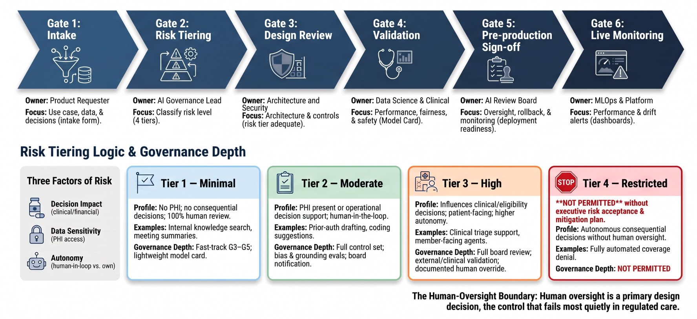

# Responsible AI Governance for Healthcare, Built to Ship

**The hard part of enterprise healthcare AI is not building models. It is getting them into
production without a governance process that takes a quarter, and proving they are safe once they
are there.**

Most healthcare organizations do not lack AI ideas. They have a backlog of them stuck in review.
Every use case is treated as equally risky, reviews run one after another, and each team rebuilds
the same controls. The result is a governance function that reads as a blocker instead of an
enabler.

This folder is my answer to that: a governance framework, driven by risk and evidence, that moves
lower risk use cases quickly, applies real scrutiny where it matters, and produces the audit
evidence regulators expect. It is implemented as reusable artifacts and automated gates rather than
a slide deck. Operating this way took enterprise AI use case approvals from roughly 12 weeks to 3,
and moved more than 25 generative AI use cases into production under a single, defensible standard.

> **Provenance.** The outcomes above are career results. Everything runnable in this folder is an
> independent reference implementation built on **synthetic data** and public standards, with no
> client systems, proprietary code, or PHI. See [`../docs/data-provenance.md`](../docs/data-provenance.md).

---

## Why approval time drops without lowering the bar

The speed does not come from skipping governance. It comes from **structuring** it. Five mechanisms
do the work.

1. **Standardized intake.** One template captures purpose, data, decision impact, and autonomy up
   front, so review starts with complete information instead of a long exchange of questions.
2. **Triage by risk.** A use case is tiered on day one. An internal assistant that carries little
   risk does not get the same review as a model that influences coverage decisions. The depth of
   governance scales to the risk.
3. **Patterns approved in advance.** Common architectures, such as RAG over internal documents or
   drafting with a human in the loop, ship with guardrails that are already blessed. Teams adopt a
   pattern instead of defending a new one.
4. **Parallel review.** Security, privacy, clinical, and legal assess at the same time against a
   shared control set, rather than waiting in a queue.
5. **Reusable evidence.** Model cards, evaluation reports, and control mappings are generated once as
   artifacts and reused across use cases and audits.

The rest of this document is that framework: the lifecycle, the risk tiers, the control catalog, and
how each control maps to the regulatory frameworks a healthcare CISO and Chief AI Officer answer to.

## The governance lifecycle

Every use case moves through six gates. Each gate has an owner, a required artifact, and a pass
condition, so that "approved" means something specific and repeatable.

  

| Gate | Question it answers | Required artifact | Owner |
|---|---|---|---|
| **Intake** | What is this, what data, and what decision does it touch? | Use case intake form | Product or requester |
| **Risk tiering** | How much scrutiny does it need? | Risk classification | AI governance lead |
| **Design review** | Is the architecture and control set adequate for its tier? | Design brief and control plan | Architecture and Security |
| **Validation** | Does it perform, and is it fair, grounded, and safe? | Model card and evaluation report | Data science and Clinical |
| **Readiness approval** | Are oversight, rollback, and monitoring in place? | Deployment readiness checklist | AI review board |
| **Live monitoring** | Is it still behaving in production? | Monitoring dashboard and drift alerts | MLOps or platform |

Use cases with low risk (Tier 1) move quickly from G3 to G5 against patterns approved in advance.
Use cases with high risk (Tier 3) get full board review, external validation where warranted, and
heightened monitoring.

## Risk tiering

Tier is a function of three factors: **decision impact** (does the output inform a clinical,
coverage, or financial decision?), **data sensitivity** (does it touch PHI?), and **autonomy** (does
a human review every output, or can the system act on its own?).

| Tier | Profile | Examples | Governance depth |
|---|---|---|---|
| **1: Minimal** | No PHI, no consequential decision, a human reviews all output | Internal knowledge search, meeting summaries | Fast track based on patterns; lightweight model card |
| **2: Moderate** | PHI present, or operational decision support with a human in the loop | Prior authorization drafting, denial letter assistance, coding suggestions | Full control set; bias and grounding evaluations; board notification |
| **3: High** | Influences clinical, coverage, or eligibility decisions, or interacts directly with patients | Risk adjustment inference, clinical triage support, agents that interact with members | Full board review; external or clinical validation; enhanced monitoring; documented human override |
| **4: Restricted** | Autonomous consequential decisions without meaningful human oversight | Fully automated coverage denial | Not permitted under this framework without executive risk acceptance and a mitigation plan |

The tiers are deliberately conservative on autonomy. In regulated care, the boundary of human
oversight is the control that fails most quietly, so this framework treats one question as a first
class design decision rather than a disclaimer: who can the model act on behalf of, and who checks
it?

## What is in this folder

| Path | What it is |
|---|---|
| `usecase-intake-template.md` | The G1 form: purpose, data classification, decision impact, autonomy, and success criteria. |
| `risk-tiering/` | The tiering rubric and a lightweight classifier that suggests a tier from intake answers. |
| `model-cards/` | A model card template plus completed examples for the repo's demo use cases. |
| `bias-fairness-harness/` | Fairness testing on synthetic cohorts (for example, with `fairlearn`): subgroup performance, disparity metrics, and reporting. |
| `eval-gates/` | Automated quality, grounding, and hallucination gates designed to run in CI and block a merge on regression. |
| `control-mappings/` | The crosswalk below, kept as maintainable files that map each control to NIST AI RMF, ISO/IEC 42001, HTI-1 DSI, and HIPAA. |

## Control catalog and regulatory crosswalk

The framework organizes controls into ten domains. Each maps to the major standards a US healthcare
AI program is measured against, so a single control implementation produces evidence for several
audits at once.

| # | Control domain | NIST AI RMF | ISO/IEC 42001 | HTI-1 DSI | HIPAA |
|---|---|---|---|---|---|
| 1 | AI governance and accountability (AI review board, roles) | GOVERN | AI policy; roles and responsibilities | IRM governance | Security Rule: administrative safeguards |
| 2 | Use case intake and risk tiering | MAP | AI system impact assessment | Scope of IRM, set by risk | n/a |
| 3 | Data governance and PHI minimization | MAP, MEASURE | Data for AI systems | Source attributes: data provenance and quality | Privacy Rule; minimum necessary; identifier removal |
| 4 | Model documentation and transparency (model cards) | GOVERN, MAP | AI system documentation | Source attributes (all 31 for Predictive DSI) | n/a |
| 5 | Fairness and bias evaluation | MEASURE | AI system impact assessment | FAVES, the *Fair* element; bias risk evaluation | n/a |
| 6 | Validation and performance (evaluation, grounding, hallucination) | MEASURE | Verification and validation | FAVES, the *Valid* and *Effective* elements | n/a |
| 7 | Human oversight and override | MANAGE | Human oversight | Intended use and oversight disclosure | n/a |
| 8 | Security and threats specific to LLMs (prompt injection, data leakage) | MANAGE | AI system security | Security risk evaluation | Security Rule: technical safeguards |
| 9 | Monitoring, drift, and incident response | MANAGE | Performance monitoring; continual improvement | Ongoing IRM maintenance | Security Rule: evaluation |
| 10 | Risk from third parties and foundation models | GOVERN, MAP | Third party and supplier relationships | External testing and validation disclosure | Business associate obligations |

Reading these frameworks correctly matters, so a few precise notes.

- **NIST AI RMF** organizes trustworthy AI practices into four functions: **GOVERN, MAP, MEASURE, and
  MANAGE**. Its **Generative AI Profile** (NIST AI 600-1) extends them to risks specific to
  generative AI, such as confabulation and data leakage. This framework uses the four functions as
  its backbone.
- **ISO/IEC 42001:2023** is the certifiable AI Management System (AIMS) standard. Its Annex A control
  areas map cleanly onto the domains above, which makes this framework a running start toward
  certification rather than a parallel effort.
- **ONC's HTI-1 final rule** (now under **ASTP/ONC**) introduced the **Predictive Decision Support
  Intervention (Predictive DSI)** criterion at 45 CFR 170.315(b)(11), effective for certified health
  IT from **January 1, 2025**. It requires **Intervention Risk Management (IRM)** across data
  governance and the evaluation of validity, fairness, safety, and security. It requires disclosure
  of **31 source attributes** for Predictive DSIs, and it organizes its transparency goal around
  **FAVES: Fair, Appropriate, Valid, Effective, and Safe**.
- **A deliberate scope note.** HTI-1 binds *certified health IT developers*, not payers or every
  enterprise AI team. This framework adopts FAVES and IRM as an operating standard even where they do
  not strictly apply, because they are the clearest articulation regulators have given of what
  trustworthy healthcare AI means. Building to them now is cheaper than retrofitting later.

## What this framework does not do, and where it needs judgment

Honest limits, because a governance framework that claims to be complete is the least trustworthy
kind.

- **It does not replace clinical validation.** For anything touching a clinical decision, the model
  card and evaluations are necessary but not sufficient. Clinical subject matter review, and where
  appropriate a prospective evaluation, still gate deployment.
- **Fairness metrics are contested.** The harness reports several disparity measures because no
  single fairness metric is correct for every context. Choosing which one governs a given use case is
  a documented human decision, not a threshold the tool sets.
- **The regulatory surface is moving.** State AI laws, the FDA's evolving stance on AI enabled
  devices, and the EU AI Act's healthcare provisions all shift the picture. The crosswalk is
  maintained, not frozen, so treat dates and citations as current as of a point in time, and verify
  before relying on them.
- **Autonomy tiering is intentionally conservative.** Reasonable programs will draw the line between
  Tier 3 and Tier 4 differently. The point is that the line is drawn explicitly and signed off, not
  that this exact placement is the only defensible one.

---

*Part of [Healthcare Cloud, Data & AI](../README.md). Built on synthetic data and public standards.
This reflects my own perspectives and independent work, not those of any employer or client.*
